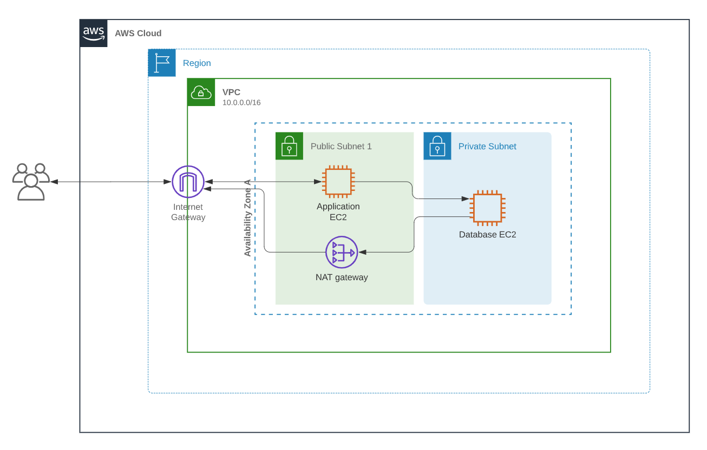

# T3A3 - Coder Academy Term 3 Assessment

## Brief 

An organisation with existing products and services has approached you to build a prototype that extends or improves an existing part of their product/service. They require you to produce a complete application/business layer (server-side) and data layer (server-side) with a basic presentation layer(client-side) that would integrate with their existing systems/applications, but would substantially improve a small aspect of functionality. You must utilise appropriate Python packages for the implementation of the data and business layers, and provide a report on the professional legal, ethical and legal considerations relating to the system, as well as the privacy and security concerns for the system.

## Requirements

### Business Logic, Data Access and Templates

* Implements an application layer which interfaces with a database to solve business problems
* Produces a professional report that provides an analysis of privacy and security concerns relating to a system
* Produces a professional report which discusses professional, ethical and legal obligations relating to a system
* Uses programming language features or frameworks to implement a data model
* Uses programming language features or frameworks to manipulate a data model
* Uses programming language features or frameworks to display data
* Implements application layer which utilises a database to produce aggregated data relating to business matters
* Implements input validation and integrity checks on data to address business risks

### Database Scripting and Queries

* Analyses a problem scenario and creates database tables and fields
* Analyses a problem scenario and creates relationships between tables which enable queries relevant to the scenario
* Analyses a problem scenario and implements integrity checks relevant to the scenario
* Develops complex queries which select, filter, group and order data.
* Develops complex queries which join tables together.
* Implements a script to export all data from the database.


## Frameework to Extend AirBnB

### AirWeights - Gym Equipment Sharing

This is a web application that is an extension of AirBNB's current framework. It is designed with the primary person of connecting people with 
gym equipment they are no longer using with people who wish to hire the equipment. The target 
for this shall be people requiring specific gear. People who want to take action on their health
at home without the outlay. Or people just looking to try different things to see what works for them.
All payments and hiring shall be done through the application. 


## Installation

### Dependancies


Create a new directory and cd into it
* Clone git repo
* If not running python 3.8, run the following bash commands

* sudo apt update
* sudo apt install python3.8
* Create a virtual enviornment
* sudo apt-get install python3-pip
* sudo apt-get install python3-venv
* python3 -m venv venv
* source venv/bin/activate
* Install the modules in requirements.txt
* cd into folder
* pip install -r requirements.txt
* Run the Program
* cd src
* set flask variables
* ```$ export FLASK_APP=main.py.py```
* ```   $ export FLASK_ENV=development```
*```flask run```


A Swagger file is also available showing the endpoints. A database has been deployed on an EC2 instance and is synced to the .env file in this project. To perform all duties relation to admin please login as:
 * email:test0@test.com 
 * password: 123456 

 You shall need to copy the JWT token generated to perform actions required. This particular user is the only one with admin rights which is restricted in the database dump end point.
 The endpoint "/equipment/" contains the html representation of some of the output from this application.

 The database has been seeded with faker and random generated data. There is a copy of the migrations for the database in migrations/versions.


## Produces a professional report that provides an analysis of privacy and security concerns relating to a system

### Discuss how the application will handle the privacy of user data within the system, and how security features of the frameworks you are utilising will assist to mitigate security concerns. Example: discuss how the use of ORMs mitigate SQL injection attacks, and how API frameworks such as ExpressJS can handle the sanitisation of user input.

Hashing shall be used to store passwords. Passwords shall be hashed and stored as a hash so that in the unlikely case of a data breach access to the users information would still be restricted by the hashed password. Boto3 shall be used for the hash as it is a slow hasher. This makes it extremely difficult to perform brute force attacks due to the slowness of the hashing algorithm. A brute force attack would take too long to complete and thus be ineffectual in trying to access the database

The database itself shall be stored in a VPC which has the limited access to the outside world and can only be accessed through the EC2 server running flask. The EC2 instance that shall be running the back-end through flask shall be run on a VPC inside a public subnet. The database that shall be holding all the  user data shall be run form an EC2 instance inside a private subnet. A  NAT gateway shall enable information to be sent out of the database. However all information going in shall be directed through the EC2 instance running the back-end, in this instance it shall be flask. All maintenance on the EC2 database server shall ahve to be done by accessing the EC2 instance running flask and then from there accessing the database. Using this structure makes the database much harder to access and the data more secure.


		
JWT tokens shall be used when logging in and for any user specific actions. These JWT tokens shall have an expiry time on them limiting their usefulness if stolen.
Nginx shall be used as the webserver so that the connection is HTTPS, the use of HTTPS and TLS/SSL ensures that the data is securing as it goes too and from the website. SSL certificates shall be maintained for the website to ensure the correct data management back and forward between users and the website so that it doesn't get intercepted and unhashed.

ORMS will be used to sanitise the data and due to the use of ORM's handling all the queries a sql will injection can't occur because it would be rejected by the ORM as invalid. The use of data types also shall reduce the chance of a sql injection happening as combined with the ORM it makes it harder for the "hacker" to escaped the prepared sql query. The data is already recognised to be a string and is treated as such without the hacker able to escape out of the string. This goes for all the different data types. as well as ensuring what fields can be null and what can't and to help maintain the database integrity and ward off any attacks. The use of a serializer such as Marshmallow is another layer on top that has its own set of validation first ensuring that the user input is in the correct format and datatype before it even gets to the ORM and database query. This extra level vastly increases the security yet again. 


## Produces a professional report which discusses professional, ethical and legal obligations relating to a system

### Discuss how you will address the following obligations as a developer:

- professional obligations (delivering the project on time, being explicit about ongoing maintenance of the system)

- ethical obligations: ensuring that the application conforms with ethical codes of conduct approved by industry

- legal obligations: that you have assessed whether the application is subject to any legal regulation, if none, consider any privacy implications

The professional obligations of this project include delivery of the scoped work to the brief. Whilst maintain the minimum viable product. To do this an agile project management method shall be adopted utilising a project management board such as trello. This way the clear objectives for the project shall be maintained whilst advancing the project considerably and one item not derailing the target deadline. A CI/CD pipeline shall be utilised for on-going testing and deployment of the project. The use of continuous integration and continuous deployment shall mean that maintenance can be performed both easily and quickly with the appropriate testing. It also means that the developers shall have the freedom to continuously deploy any improvements or features that are developed continuously without having to wait for one big release. This will result in a better product for the consumer that is constantly improving and evolving as well. There will also be less bugs and pressure with releases with this approach adopted.

Ethically, the data shall be stored using secure servers without other users data being made public. The use of usernames as well limiting personal details available to other users shall be used to protect peoples privacy as well as keeping safe. As this feature shall involves the delivery and drop off of fitness equipment by individuals a guide on safe conduct and approaches shall be included on the application as well as other safeguards to protect the safety of users and individuals. A code of conduct and user guide shall also be included with this application as well as terms and conditions relating to ethical use and appropriate behaviours for users.

The data gathered on users through their registering shall also be limited to the purpose of this application and shall not be distributed to any third party organisations. There will be a level of moderation on discussion boards and the option to flag inappropriate messages between users. Upon review if users are found to be in breach of the terms and conditions they shall be removed from the application platform and banned. Photos shall also be reviewed as well as the content of the equipment that is being put up for lease to ensure that the equipment and photos are appropriate and falls in the terms and conditions of the application. This reflects on both the ethical, privacy and legal obligations that we make as developers of applications such as these.

Once a user deletes his or her data the data related specifically to that user shall also be removed from the database. In the case of related data such as equipment orders, some of that information shall remain as it is connected to another user as well as a transaction that has occurred financially which does need to be maintained. 

The application shall fulfill it's legal requirements as stated by the consumer data right (CDR.) In terms of how it handles consumers data and their privacy. As well as required obligations if response to a breach as outlined in the CDR. 